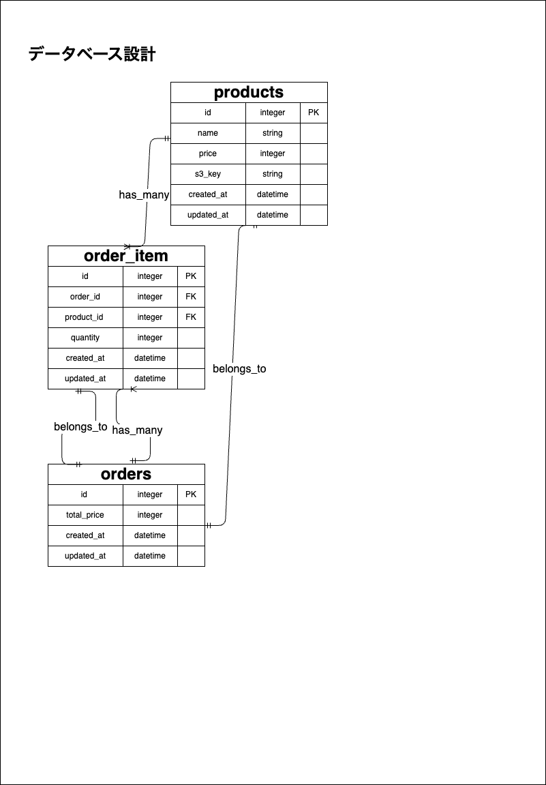
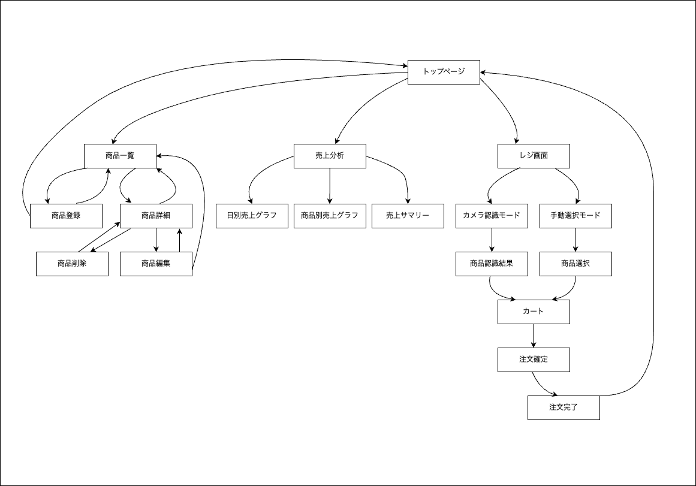

# 🧾 Kantan Register

**高齢者にもやさしい、シンプルで直感的に使えるAI画像認識Webレジアプリケーション。**  
Rails × Python（Flask）で構築し、商品登録・撮影認識・売上分析まで一括管理。

---

## Overview

🍞 誰の、何を解決するために
本アプリは、個人または少人数でパン屋を経営している方のために開発された、パンの価格を覚えなくていい画像認識レジシステムです。

パン屋では、商品ごとにバーコードがないためレジ入力は手動が基本。さらに、小麦粉など原材料の価格高騰によりパンの販売価格は頻繁に変動し、そのたびに覚え直す必要があります。
忙しい販売現場で価格や商品名を間違えれば損失にもつながり、精神的な負担も大きくなります。
しかし既存の高機能レジ（BakeryScan、スマレジ等）は、費用や導入ハードルの高さから、個人店では手が出しにくいのが現実です。

そこで本アプリでは、パンの画像を撮るだけで自動的に名前と価格を表示。
誰でも簡単に使えるよう、Rails × Python × AI画像認識を活用し、シンプル・低コスト・業務特化を実現しました。

💡 なぜこのアプリを作ろうと思ったのか
私自身がパン屋でレジ業務を行う中で、価格の変動によって覚えた値段がすぐに変わってしまう現場の大変さを実感しました。
忙しい中で正確に覚え続けるのは難しく、うっかり安く販売してしまえばお店にとっても大きな損失です。

「もっと簡単に、もっと安く、それでいて現場の悩みにきちんと応えるものを作りたい」
そんな思いから、写真を撮るだけで価格がわかるレジシステムを自作することに決めました。

パンの画像と価格を一度登録しておけば、あとは販売時に写真を撮るだけ。覚える必要がなくなり、レジ業務の負担が大幅に軽減されます。
これにより、販売スタッフはパン作りや接客といった本来の業務に集中できるようになります。

---


## URL
Railsアプリケーション: https://kantan-register.onrender.com  
AI画像認識サーバー(Flask): https://ai-server-f6si.onrender.com (Railsアプリから内部的に呼び出されます)

---

## Basic 認証 
- ユーザー名：`admin`  
- パスワード：`2222`  

---


## 主な機能

| 機能 | 説明 |
|------|------|
| **商品管理** | カタカナのみの名前制約、価格バリデーション |
| **画像アップロード** | ActiveStorage (S3連携)＋カメラ撮影 |
| **AI画像認識レジ** | FlaskでSSIM/SIFT/ORBを用いた商品特定 |
| **キーワード検索レジ** | 商品名キーワード検索でカートに追加 |
| **カート管理** | 商品追加・数量更新・カートクリア |
| **売上分析ダッシュボード** | 年次/月次/日次のグラフとサマリー表示 |
| **管理リセット機能** | `/admin/reset_all?token=...` |
| **Basic認証** | 管理画面に認証を適用 |


---

## テクノロジー

### Rails サイド

- Ruby 3.2.0 / Rails 7.1.5.1 
- データベース: MySQL 8.0（開発環境）、PostgreSQL（本番環境 on Render.com）
- アセットパイプライン: Sprockets (主に `app/assets` を使用)
- フロントエンド: Turbo Drive, Stimulus.js
- 画像管理: ActiveStorage (Amazon S3 に画像を保存)
- 売上分析: groupdate gem
- グラフ描画: Chart.js

本番環境では、Railsが `url_for(@product.image, host: ...)` を使ってS3上の画像URLを生成し、FlaskサーバーはこのURLから `requests.get(image_url)` を用いて画像データを取得・処理します。

### Python（画像認識）サイド

- Python 3.13.2  
- Flask 3.1.1
- Pillow (PIL Fork)
- NumPy
- scikit-image (SSIM計算用)
- OpenCV (ORB/SIFT特徴量抽出用)
- gunicorn  
- Flask-CORS  
- requests 2.31.0
- SQLAlchemy 2.0.20 / psycopg2-binary 2.9.6（本番でDBマッピングを使う場合）


#### `requirements.txt` 抜粋
<!-- このセクションは、主要なライブラリとそのバージョンを記載するのに役立ちます -->
```text
Flask==3.1.1
Pillow==11.2.1
numpy==2.2.6
scikit-image==0.25.2
opencv-python==4.11.0.86
gunicorn==23.0.0
Flask-CORS==6.0.0
requests==2.32.3
SQLAlchemy==2.0.20
psycopg2-binary==2.9.6
boto3==1.38.23

```


## 画面遷移
- **トップ** → 商品一覧 → 新規登録／編集
- **レジ画面** → カメラ認識 or キーワード → カート追加
- **カート画面** → 数量更新 → 会計
- **注文完了** → 履歴保存
- **売上分析** → 年次／月次／日次の切替

## データベース設計（一部）

### products テーブル
| Column      | Type     | Options                         |
|-------------|----------|---------------------------------|
| `name`      | string   | null: false, format: katakana   |
| `price`     | integer  | null: false, numericality: >0   |
| `s3_key`    | string   | 登録済み画像の S3 キー保存用        |
| `created_at`| datetime |                                 |
| `updated_at`| datetime |                                 |


### orders / order_items テーブル
- `orders`      : 購入トランザクション  
- `order_items` : 商品×数量×価格の中間テーブル  


## データベース構造図（ER図）



## 画面遷移図（ビジュアル）




## 開発背景
- 小規模店舗やイベント出店での手軽な POS を目指して開発 
- Flask で画像認識処理を切り出し、Rails とは疎結合化
- シンプル UI で誰でも扱いやすい

## 注意事項（ご利用前にお読みください）

- 商品を登録・編集・削除した場合は、**必ず「AIサーバーのキャッシュを再構築」ボタンを押してください**。  
  → これを行わないと、Flask側の認識結果に反映されません。

- 商品を撮影する際は、以下を心がけてください：  
  - **背景は白色**にする（例：白テーブル・白い紙の上など）  
  - 商品が**画面の80％程度を占める大きさ**になるように調整  
  - **ピントをしっかり合わせてから撮影**する  

上記を守ることで、AI画像認識の精度が大きく向上します。


## 使い方
1. **トップページ** → 商品登録  
2. **レジ画面** → 「撮影する」
3. 画像認識 or キーワードでカートに追加  
4. **会計** → 注文完了  
5. **売上分析** タブ切替 （グラフ表示で売上を可視化） 


## 📱 スマホ操作デモ（録画）
実際のレジ操作の様子を動画で確認できます：

- [🆕 新規商品登録 → AIキャッシュ再構築の流れ](https://i.gyazo.com/31e1a58c9cbf006d1d09f5e50cfe6e32.gif)
- [📸 レジ画面①：カメラ撮影 → 商品認識 → 会計完了](https://i.gyazo.com/0faad65d0ece249a0482196c472e7b0a.gif)
- [🛒 レジ画面②：カメラ撮影 → カート編集 → 会計完了](https://i.gyazo.com/78706e029cdd0edc752c25403b908f11.gif)
- [📊 分析画面：日別 → 月間 → 年間](https://i.gyazo.com/47951c9c86bac043f663c11b9346a0dc.gif)


## 今後の予定
- 在庫数アラート  
- 複数店舗対応  
- Web プッシュ通知
- レスポンシブ改善／ダークモード  

## 制作時間
約 **140時間**

---